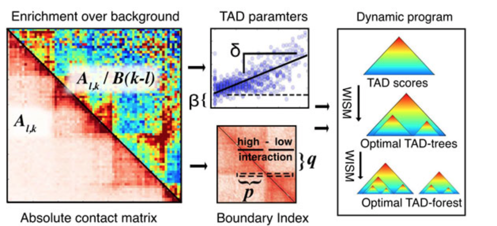

# TAD Calling

TAD Calling algorithms are a set of algorithms which have the task of identification of hierarchical topological domains in Hi-C data.
There are several algorithms which are supported by HiCPack such as TADTree, TADbit and etc. You can easily set the TAD Calling algorithm you want to use in data using `TAD_ALGORITHM` in HiCPack config file.
Here are some introductions about some of these algorithms.

## TADTree

The above picture is an Overview of TADtree algorithm. Beginning with contact matrix A, TADTree computes the fold-enrichment over background for each pair of positions. For each interval [i,j], TADTree estimates parameters δ(i,j), β(i,j). Next, for each genomic position i we compute the boundary index, a 1D statistic that looks for local shifts in interaction frequency at TAD boundaries. Finally, a dynamic program finds TAD trees that maximize the boundary index and best fit the contact matrix A, then selects an optimal set of TAD trees to form a TAD forest.

## TADbit

TADbit is a complete Python library to deal with all steps to analyze, model and explore 3C-based data. With TADbit the user can map FASTQ files to obtain raw interaction binned matrices (Hi-C like matrices), normalize and correct interaction matrices, identify and compare the so-called Topologically Associating Domains (TADs), build 3D models from the interaction matrices, and finally, extract structural properties from the models. TADbit is complemented by TADkit for visualizing 3D models.