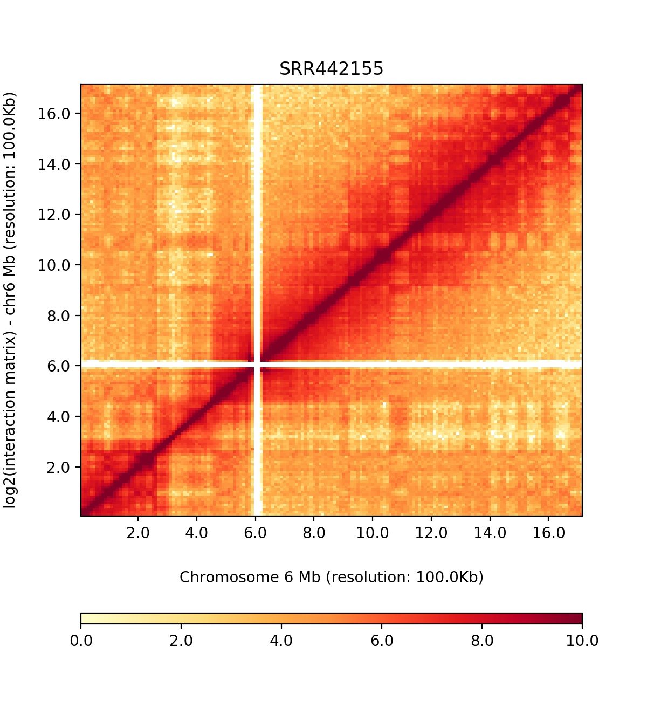

# Visualization 

There all some visualization methods which are for integrating different data types with interaction matrices. One of them is used in HiCPack for visualizing Contact maps and the method is HiCPlotter. All visualization results of HiCPack will be saved in `visualization_results` directory. There will be more visualization tools in supported by HiCPack in the near future.

## HiCPlotter 

HiCPlotter is a Python data visualization tool and designed by Kadir Akdemir (kcakedemir at mdanderson dot org / find me on Twitter) while in Lynda Chin's Lab at the University of Texas MD Anderson Cancer Center, Houston, TX, USA.
You can use HiCPlotter for bar plots, histograms, arc diagrams, tile plots and etc. You can use HiCPlotter to construct the whole genome plot. So this package provides plenty of options for you to visualize your matrix.
Here's an example of plotting whole genome contact map for a sample with HiCPlotter.

